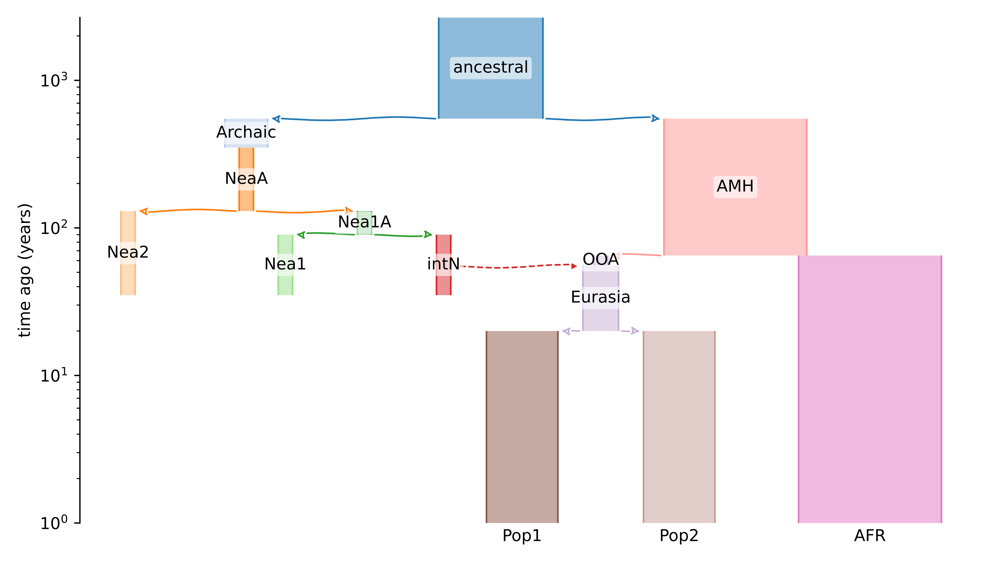

# Best practices to detect archaic sequences using IBDmix
This protocol describes good practices on how to look for archaic segments using state-of-the-art tools. In particular, it focuses on optimising the use of IBDmix in different demographic scenarios and explores its use on ancient data [IBDmix Github](https://github.com/PrincetonUniversity/IBDmix). 


# Demogrpahic model

First, we need a demographic model that represents important characteristics of our dataset. We can use demes [Demes Github](https://popsim-consortium.github.io/demes-spec-docs/main/introduction.html) to visualise the demographic model of interest as follow:
````
demesdraw tubes --log-time modelA.yaml modelA_nlog.svg
````
[]()

The name of the model must be specified in the modelA.yaml and will be used for downstream analyses. 

# Workflow Simulations
### Step 0: Download software and packages 
Pre-install the latest version of Python and R. We run the simulations using the Snakemake workflow management system. Please, download Snakemake following the instructions here: [Snakemake Install](https://snakemake.readthedocs.io/en/stable/getting_started/installation.html).
- Slendr: [Slendr Install](https://cloud.r-project.org/web/packages/slendr/vignettes/vignette-00-installation.html)
- R packages: ````install.packages(c("dplyr", "slendr","ggplot2", "admixr","purrr","readr","optparse"))````

Alternatively, you can use the provided environmental.yaml file to create a new environment for this project
1. Clone this repository (git clone XXXX)
2. Create a conda environment (conda env create --name XXX --file environment.yaml). Modify the prefix at the end of this YAML file (and the name of the environment if interested)
3. Update the path to the config file in the snakemake rules (configfile: path/to/config.yaml)

### Step 1: Get your config.yaml ready
Check the toy config.yaml file. You will need to specify:
- name of the model ('modelA')
- path to environmental.yaml file ('path/to/environmental.yaml')
- your output directory ('path/2/outputs')

### Step 2: run simulations and get tree sequences 
Step 2, uses the Snakefile named "rules/00.gen_simuls_step1.smk" which generates the simulation outputs. The pipeline includes a few jobs to generate the simulations for which we chose the package "slendr" [Slendr Manual](https://www.slendr.net/articles/vignette-05-tree-sequences.html). In our example, we use the simulator "slim" but similarly you can use "msprime". We will also be specified a seed to do replicates. 

You can run the Snakefile as follows:
````
snakemake --snakefile rules/00.gen_simuls_step1.smk --cores xx
````
This will generate several files in some directories under your output-dir:
- {model}_{seed}_{time}ky/results
- {model}_{seed}_{time}ky/logs
- {model}_{seed}_{time}ky/model

It runs 3 scripts:
1. scripts/00.introgression.R: generates the simulations and outputs _vcf_ file, the tree sequence data and the simulation model. 
2. scripts/00.detect_tracts.py: iterates through every genomic locus and outputs the introgressed tracts. 
3. scripts/00.calculate_f4_ratio.r: calculates the f4 ratio. This step is useful to have a glance at the data and double-check the simulations' output. 


# Archaic segments detection using IBDmix software
We modified the Snakemake pipeline from [IBDmix Github](https://github.com/PrincetonUniversity/IBDmix) to run IBDmix on several archaic genomes for all simulations. 
````
snakemake --snakefile rules/01.simulations_arc_detection.smk --cores xx
````

# Performance evaluation 
 We calculate the performance at the base-pair and window levels. Difference measures are calculated to better calibrate the software. 
 
````
snakemake --snakefile rules/02.eval_performance.smk --cores xx
````

